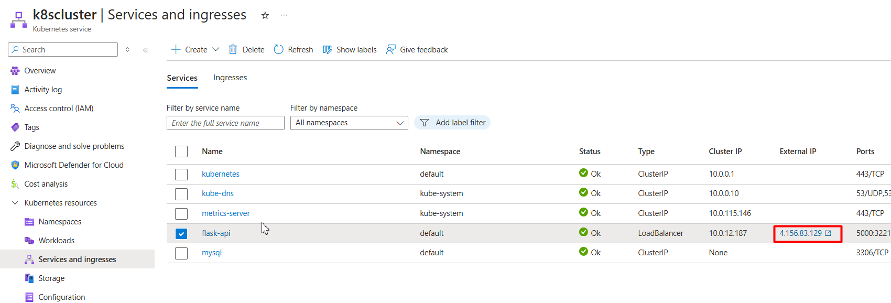
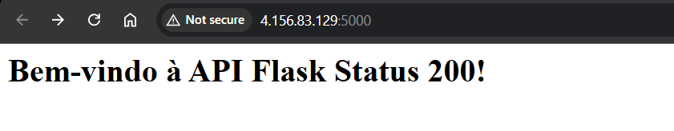
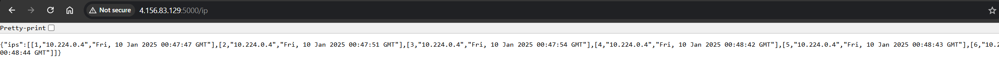

# Flask-Project

## Goal

This is a personal project that I want to start as a small initiative and improve throughout the year. I will explain step by step what I did to start and create this project.

The idea is to access the endpoint, save it in a database, and show the IPs that accessed the endpoint.

## Tools

- Github Actions
- Terraform 
- Python 
- Kubernetes
- Docker
- Azure
- MySQL

## Step 1: Setup Environment

1. Create my repository name in Github: `Projeto-Flask`
2. Run the Azure CLI command to create the service principal:

```
az ad sp create-for-rbac --name "theuser" --role owner --scopes /subscriptions/SUBSCRIPTION_ID --sdk-auth
```

3. Create the secrets 

```
AZURE_CLIENT_ID: Copy the clientId from the JSON output.
AZURE_CLIENT_SECRET: Copy the clientSecret from the JSON output.
AZURE_TENANT_ID: Copy the tenantId from the JSON output.
AZURE_SUBSCRIPTION_ID: Copy the subscriptionId from the JSON output.
AZURE_CREDENTIALS: Paste the entire JSON output in this field.
```

4. Create resource group in Azure: `projeto-flask`
5. Create storage in Azure: `storagechiroli`
6. Create container tfstate: `tfstate`
7. Create container registry: `mdcrepositorychiroli`


## Step 2: Create Application Python and Integration with Mysql  

1. Create Dockerfile to Mysql
```
FROM mysql:latest

# Copiar o arquivo init.sql para o diretório de inicialização do MySQL
COPY init.sql /docker-entrypoint-initdb.d/

# Configuração do ambiente 
ENV MYSQL_ROOT_PASSWORD=Mindthegap@0823*
ENV MYSQL_DATABASE=test_db

# Expor a porta 3306
EXPOSE 3306

# Comando padrão do MySQL
CMD ["mysqld"]
```
2. Create `init.sql`

```
USE test_db;

CREATE TABLE ip_addresses (
    id INT AUTO_INCREMENT PRIMARY KEY,
    ip_address VARCHAR(45) NOT NULL,
    created_at TIMESTAMP DEFAULT CURRENT_TIMESTAMP
);
```
3. Create Python script `app.py`

```
from flask import Flask, jsonify, make_response, request
import mysql.connector
import os

app = Flask(__name__)

def get_db_connection():
    connection = mysql.connector.connect(
        host=os.getenv("DB_HOST", "localhost"),
        user="root",
        password="Mindthegap@0823*",
        auth_plugin='mysql_native_password',
        database="test_db"
    )
    return connection

@app.route('/')
def home():
    client_ip = request.remote_addr
    try:
        # Conectar ao banco de dados
        conn = get_db_connection()
        cursor = conn.cursor()

        # Inserir o IP na tabela 'ip_addresses'
        cursor.execute("INSERT INTO ip_addresses (ip_address) VALUES (%s)", (client_ip,))

        # Salvar as alterações no banco
        conn.commit()

        # Fechar a conexão
        cursor.close()
        conn.close()

        status = make_response("<h1>Bem-vindo à API Flask Status 200!</h1>", 200)
        return status
    except mysql.connector.Error as err:
        app.logger.error(f"Erro ao salvar no banco de dados: {err}")
        return jsonify({"error": f"Erro ao salvar no banco de dados: {err}"}), 500

@app.route('/ping', methods=['GET'])
def ping():
    return jsonify({"message": "pong"})

@app.route('/ip', methods=['GET'])
def get_ip():
    try:
        # Conectar ao banco de dados
        conn = get_db_connection()
        cursor = conn.cursor()

        # Selecionar os IPs da tabela 'ip_addresses'
        cursor.execute("SELECT * FROM ip_addresses;")

        # Obter os resultados
        ips = cursor.fetchall()

        # Fechar a conexão
        cursor.close()
        conn.close()

        return jsonify({"ips": ips})
    except mysql.connector.Error as err:
        app.logger.error(f"Erro ao conectar no banco de dados: {err}")
        return jsonify({"error": f"Erro ao conectar no banco de dados: {err}"}), 500

if __name__ == '__main__':
    app.run(host='0.0.0.0', port=5000)
```

4. Create requirements.txt
```
Flask
jsonify
make_response
requests
mysql-connector-python
#mysql.connector
```

5. Create Python DockerFile 
```
FROM python:3.9-alpine
RUN apk update && apk add --no-cache \
    mysql-client \
    build-base \
    libffi-dev \
    musl-dev \
    gcc \
    python3-dev \
    mariadb-connector-c-dev
RUN python -m pip install --upgrade pip
WORKDIR /app
COPY . .
RUN pip3 install -r requirements.txt
CMD ["python", "app.py"]
```

6. After this step, you can use a Docker Compose file to perform a test.

7. Up the Python image to Docker Hub
```
docker tag flask-api-db:latest joaochiroli123/flask-api-db:latest
```

8. Up the Mysql image to Docker Hub
```
docker tag flask-api-db:latest joaochiroli123/mysql-flaskapi
```

## Step 3: Pushing the image from Dockerhub to the Container Registry in Azure

1. Access your Azure Cloud Shell
2. Access the registry 
```
az acr login --name mdcrepositorychiroli
```
3. Push the **Python** image to registry
```
az acr import --name mdcrepositorychiroli --source docker.io/joaochiroli123/flask-api-db:latest --image flask-api-db:latest
```
4. Push the **Mysql** image to registry
```
az acr import --name mdcrepositorychiroli --source docker.io/joaochiroli123/mysql-flaskapi:latest --image mysql-copyinitsql:v1
```

## Step 4: Create and test the Terraform configuration

1. Create my main.tf: `touch main.tf`
2. Don't forget to change it to your subscription ID: `<put_your_subscription_id>` 
```
terraform {
  required_providers {
    azurerm = {
      source  = "hashicorp/azurerm"
      version = "~> 4.14" # Certifique-se de ajustar a versão conforme necessário
    }
  }

  backend "azurerm" {
    resource_group_name  = "projeto-flask"
    storage_account_name = "storagechiroli"
    container_name       = "tfstates"
    key                  = "terraform.tfstate"
  }
}

provider "azurerm" {
  features {}
  subscription_id = "<put_your_subscription_id>"
}

data "azurerm_resource_group" "example" {
  name     = "projeto-flask"
}

# data "azurerm_container_registry" "acr" {
#   name                = "mdcrepositorychiroli" # Substitua pelo nome do seu ACR
#   resource_group_name = data.azurerm_resource_group.example.name
# }

resource "azurerm_kubernetes_cluster" "example" {
  name                = "k8scluster"
  location            = data.azurerm_resource_group.example.location
  resource_group_name = data.azurerm_resource_group.example.name
  dns_prefix          = "k8scluster"

  default_node_pool {
    name       = "default"
    node_count = 1
    vm_size    = "Standard_D2_v2"
    auto_scaling_enabled = true
    min_count           = 1
    max_count           = 3
  }

  identity {
    type = "SystemAssigned"
  }

  tags = {
    Environment = "Production"
  }
}

# Criação da role assignment para o ACR
# resource "azurerm_role_assignment" "acr_pull" {
#   principal_id         = azurerm_kubernetes_cluster.example.identity[0].principal_id
#   role_definition_name = "AcrPull"
#   scope                = data.azurerm_container_registry.acr.id
#   skip_service_principal_aad_check = true
# }
```
2. Initialize the Terraform: `terraform init`
3. Execute: `terraform apply`
4. Apply: `terraform apply`


## Step 5: Setup the GitHub Repository

1. Clone the repository locally: `git clone https://github.com/joaochiroli/Projeto-Flask.git`
2. Navigate into the repository: `cd Projeto-Flask`
3. Create the directory for GitHub Actions: `mkdir -p .github/workflows`

## Step 6: Create the Workflow with Terraform configuration and Apply the Manifests 

1. Create the workflow: `touch .github/workflows/workflow.yaml` the information about the workflow.yml can be found in the file inside this repository.
2. One key point is about secrets in my kube-manifests. I need to create a secret with the registry credentials so my Kubernetes cluster can access the images in my registry and perform the pull. 
3. About my manifests is simple contain:
    - 2 Deployments for my services: mysql and python
    - 1 Volume 
    - 1 Storage-class
    - 1 Load Balancer 
    - 1 Service for Mysql

## Step 7: Acces the Application 

1. You can found the ip going to this page in Azure  



2. Access first page with the home



3. Access second page with the Ips

